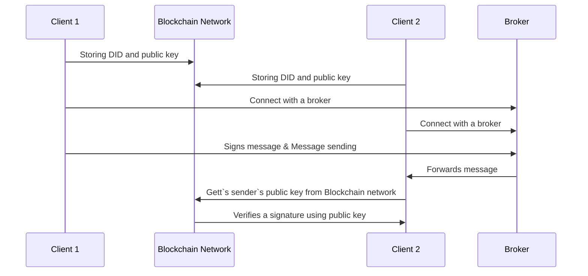

# Decentralized MQTT
> 메타버스와 IoT(Internet of Things) 기술의 통합 환경에서 발생할 수 있는 문제점을 분석하고 이를 해결하기 위하여 MQTT(Message Queuing Telemetry Transport) 프로토콜과 분산형 공개키 인프라(DPKI, Distributed Public Key Infrastructure)를 결합한 아키텍처를 제안한다. 또한, 제시된 아키텍처를 유니티 클라이언트와 RaspberryPi 디바이스를 통해 구현함으로써 메타버스와 IoT 환경에서의 보안 문제를 효과적으로 해결할 수 있음을 검증한다.

 

## Communication sequence

 

## Progress
### [~10.15](https://github.com/Hongyoosung/Metaverse_for_IoT/blob/main/Decentralized_MQTT/Progress/231015.md)
- Unity 클라이언트와 RaspberryPi 디바이스의 MQTT 통신 완료.
- Ledger 함수 호출 문제

### [~10.16](https://github.com/Hongyoosung/Metaverse_for_IoT/blob/main/Decentralized_MQTT/Progress/231016.md)
- 디바이스 센서 데이터 수신
- 토픽 배열화

### [~10.19](https://github.com/Hongyoosung/Metaverse_for_IoT/blob/main/Decentralized_MQTT/Progress/231019.md)
- 메시지 암호화

### [~10.23](https://github.com/Hongyoosung/Metaverse_for_IoT/blob/main/Decentralized_MQTT/Progress/231023.md)
- 지갑 생성, Pool 접속
- 메시지 서명

### [~11.22](https://github.com/Hongyoosung/Metaverse_for_IoT/blob/main/Decentralized_MQTT/Progress/231122.md)
- RaspberryPi에 Hyperledger-indy 설치
- 디바이스 센서 데이터 서명 및 송신
  
 

## Reference
[1] portalchu, [AvataDID](https://github.com/portalchu/Metaverse/tree/main/HyperledgerAries/AvataDID)

[2] [Hyperledger indy-SDK](https://github.com/hyperledger/indy-sdk/tree/main)

